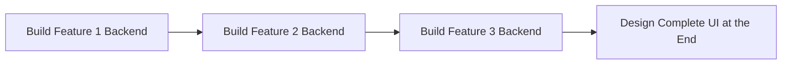
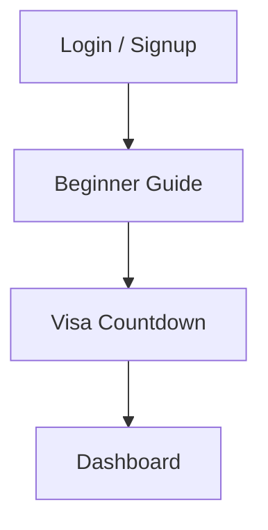

# Product Roadmap & Evolution Plan

## 🗺️ Phase-by-Phase Roadmap

```mermaid
graph TD
    A[Phase 1: Build & Ship Fast] --> B[Phase 2: Code Export & Hardening]
    B --> C[Phase 3: Scale & Heavy Backend]

    subgraph Phase 1: Build & Ship Fast
        A1[FlutterFlow + Firebase] --> A2[Validate Idea]
        A2 --> A3[Acquire Initial Users]
    end

    subgraph Phase 2: Code Export & Hardening
        B1[Export Code to VS Code] --> B2[Add Custom Security & Logic]
    end

    subgraph Phase 3: Scale & Heavy Backend
        C1[High User Demand] --> C2[Proper Cloud Functions]
        C2 --> C3[Advanced Backend Design]
    end

    style Phase 1: Build & Ship Fast fill:#f9f,stroke:#333,stroke-width:2px
```

1. **Phase 1: Build & Ship Fast**
   * Use **FlutterFlow + Firebase** to build screens and backend rapidly.
   * Launch quickly to validate the core idea and get user feedback.
2. **Phase 2: Code Export & Hardening**
   * Once validated, export the FlutterFlow source code into **VS Code**.
   * Improve code quality, write custom logic, and harden app security.
3. **Phase 3: Scale & Heavy Backend**
   * Driven strictly by user demand.
   * Implement robust cloud functions and custom backend architecture.

---

## 🛠️ Tool Selection

| Tool | Purpose / Service | Role in App |
| :--- | :--- | :--- |
| **FlutterFlow** | Visual Builder | Used to build all app screens and UI layouts visually. |
| **Firebase** | Google Backend | Powers the entire initial infrastructure using free credits. |
| | *a. Firebase Auth* | Handles secure user login and registration. |
| | *b. Firestore DB* | Holds and manages all user and application data. |
| | *c. Cloud Functions* | Runs background automation and scheduled reminders. |
| **TBD** | Future Additions | Left open for scaling tools based on Phase 3 needs. |

---

## 📚 Skills to Learn
*   System Design

---

## 🔄 The Pivot: Original vs. Updated Plan

### The Original Execution Strategy

*   **The Old Way:** Connect Firebase, build the login backend, then fully build out every feature one by one. Leave the visual user interface (UI) polish for the very end.
*   **The Problem:** Delayed the visual feel of the product and slowed down frontend user experience testing.

### 🚀 The Updated MVP Plan (Scaffolding First)

*   **The New Way:** Build all screen visual elements as **empty UI placeholders** first. 
*   **The Benefit:** Gives an immediate feel for the user flow. Hook up the Firebase backend integration to these placeholders step-by-step afterward.
*   **Current Progress:** FlutterFlow and Firebase are successfully connected. A basic login/signup page is fully functional to verify database authentication.

---

## 📐 Step 1: Scaffolding Details

### 1. Visa Countdown Feature
*   Build a quick visual placeholder box for the countdown timer.

### 2. The New Architecture 🗺️
The visa countdown UI transitions through three dynamic operational stages:

*   **Stage 1 (7% Peek):** A tiny pill-shaped component at the top of the screen displaying only the visa date.
*   **Stage 2 (35% Loading):** Tapping the Stage 1 pill expands it downward into a wider interface showing a loading progress bar. If ignored for 10 seconds, it automatically shrinks back to Stage 1.
*   **Stage 3 (100% Floating Interface):** Tapping the pill during either Stage 1 or Stage 2 triggers a custom Bottom Sheet. It slides up from the bottom, anchoring perfectly to leave exactly 15% open space at the top and 5% open space at the bottom.

### 3. The TV 
The Tv where the promotional item sit like a 

